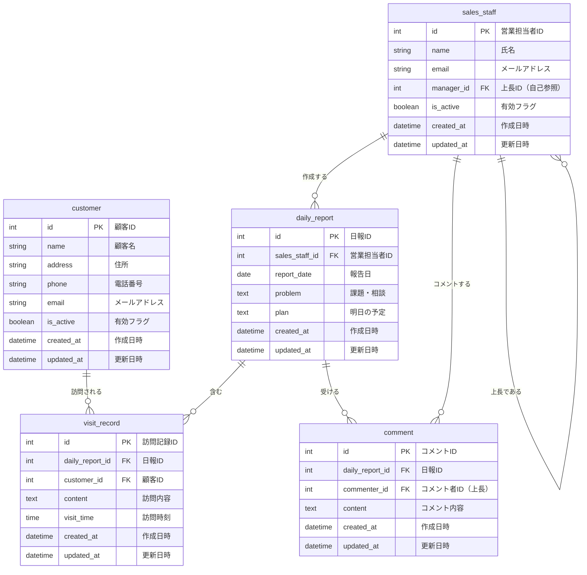

# 営業日報システム ER図

## ER図（Mermaid）



## リレーション説明

| 親テーブル | 子テーブル | 関係 | 説明 |
|-----------|-----------|------|------|
| sales_staff | daily_report | 1:N | 営業担当者は複数の日報を作成 |
| sales_staff | comment | 1:N | 上長は複数のコメントを投稿 |
| sales_staff | sales_staff | 1:N | 上長は複数の部下を持つ（自己参照） |
| daily_report | visit_record | 1:N | 日報は複数の訪問記録を含む |
| daily_report | comment | 1:N | 日報は複数のコメントを受ける |
| customer | visit_record | 1:N | 顧客は複数回訪問される |

## インデックス推奨

```sql
-- 日報検索用
CREATE INDEX idx_daily_report_date ON daily_report(report_date);
CREATE INDEX idx_daily_report_staff ON daily_report(sales_staff_id);
CREATE UNIQUE INDEX idx_daily_report_unique ON daily_report(sales_staff_id, report_date);

-- 訪問記録検索用
CREATE INDEX idx_visit_record_report ON visit_record(daily_report_id);
CREATE INDEX idx_visit_record_customer ON visit_record(customer_id);

-- コメント検索用
CREATE INDEX idx_comment_report ON comment(daily_report_id);
```
