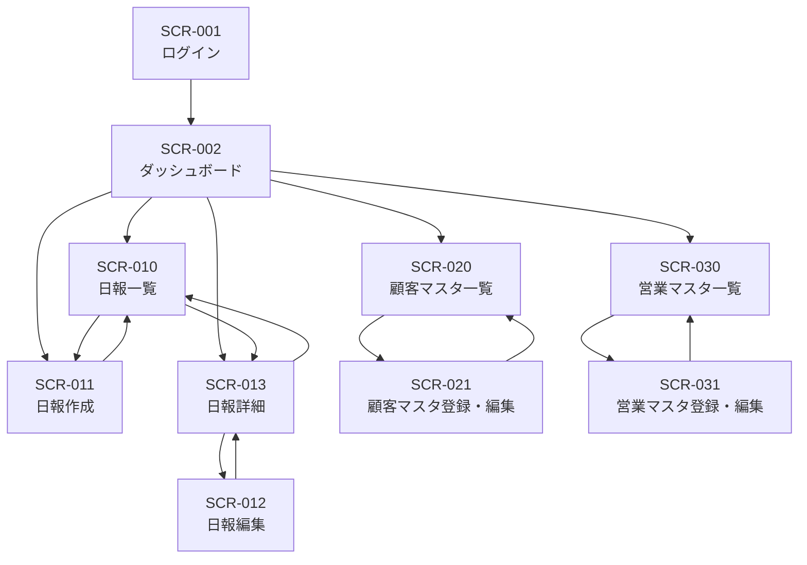

# 営業日報システム 画面定義書

## 画面一覧

| No | 画面ID | 画面名 | 概要 | 権限 |
|----|--------|--------|------|------|
| 1 | SCR-001 | ログイン | システムログイン | 全員 |
| 2 | SCR-002 | ダッシュボード | ホーム画面 | 全員 |
| 3 | SCR-010 | 日報一覧 | 日報の検索・一覧表示 | 全員 |
| 4 | SCR-011 | 日報作成 | 新規日報の作成 | 営業 |
| 5 | SCR-012 | 日報編集 | 日報の編集 | 営業（本人のみ） |
| 6 | SCR-013 | 日報詳細 | 日報の詳細表示・コメント | 全員 |
| 7 | SCR-020 | 顧客マスタ一覧 | 顧客の検索・一覧表示 | 全員 |
| 8 | SCR-021 | 顧客マスタ登録・編集 | 顧客情報の登録・編集 | 管理者 |
| 9 | SCR-030 | 営業マスタ一覧 | 営業担当者の一覧表示 | 管理者 |
| 10 | SCR-031 | 営業マスタ登録・編集 | 営業担当者の登録・編集 | 管理者 |

---

## 画面詳細

### SCR-001: ログイン画面

#### 概要
システムへのログイン認証を行う

#### 画面レイアウト
```
+------------------------------------------+
|            営業日報システム                |
|                                          |
|  +------------------------------------+  |
|  | メールアドレス                      |  |
|  | [________________________]         |  |
|  +------------------------------------+  |
|                                          |
|  +------------------------------------+  |
|  | パスワード                          |  |
|  | [________________________]         |  |
|  +------------------------------------+  |
|                                          |
|        [    ログイン    ]                |
|                                          |
+------------------------------------------+
```

#### 入力項目

| No | 項目名 | 項目ID | 型 | 必須 | 備考 |
|----|--------|--------|-----|------|------|
| 1 | メールアドレス | email | text | ○ | |
| 2 | パスワード | password | password | ○ | |

#### ボタン

| No | ボタン名 | 処理内容 |
|----|----------|----------|
| 1 | ログイン | 認証処理を実行し、成功時はダッシュボードへ遷移 |

---

### SCR-002: ダッシュボード

#### 概要
ログイン後のホーム画面。自分の日報状況と部下の日報状況を確認できる

#### 画面レイアウト
```
+----------------------------------------------------------+
| [ロゴ]  日報一覧  顧客管理  営業管理    [ユーザー名▼]     |
+----------------------------------------------------------+
|                                                          |
|  今日の日報                                    [作成]     |
|  +----------------------------------------------------+  |
|  | ステータス: 未作成 / 作成済み                       |  |
|  +----------------------------------------------------+  |
|                                                          |
|  最近の日報                                              |
|  +----------------------------------------------------+  |
|  | 日付       | 訪問件数 | コメント数 | 操作          |  |
|  |------------|----------|------------|---------------|  |
|  | 2026/01/07 | 3件      | 1件        | [詳細]        |  |
|  | 2026/01/06 | 2件      | 0件        | [詳細]        |  |
|  +----------------------------------------------------+  |
|                                                          |
|  【上長のみ表示】部下の日報状況                          |
|  +----------------------------------------------------+  |
|  | 担当者     | 日付       | ステータス | 操作        |  |
|  |------------|------------|------------|-------------|  |
|  | 山田太郎   | 2026/01/08 | 未提出     | -           |  |
|  | 鈴木花子   | 2026/01/08 | 提出済     | [詳細]      |  |
|  +----------------------------------------------------+  |
|                                                          |
+----------------------------------------------------------+
```

#### 表示項目

| No | 項目名 | 説明 |
|----|--------|------|
| 1 | 今日の日報ステータス | 本日の日報作成状況 |
| 2 | 最近の日報一覧 | 直近5件の自分の日報 |
| 3 | 部下の日報状況 | 上長のみ表示。部下の本日の日報状況 |

---

### SCR-010: 日報一覧画面

#### 概要
日報を検索・一覧表示する

#### 画面レイアウト
```
+----------------------------------------------------------+
| [ロゴ]  日報一覧  顧客管理  営業管理    [ユーザー名▼]     |
+----------------------------------------------------------+
|                                                          |
|  日報一覧                                                |
|                                                          |
|  検索条件                                                |
|  +----------------------------------------------------+  |
|  | 期間: [____] 〜 [____]  担当者: [▼全員____]        |  |
|  |                                                    |  |
|  | 顧客: [▼全顧客________]                            |  |
|  |                                    [検索] [クリア] |  |
|  +----------------------------------------------------+  |
|                                                          |
|  検索結果: 25件                                          |
|  +----------------------------------------------------+  |
|  | 日付       | 担当者   | 訪問件数 | コメント | 操作  |  |
|  |------------|----------|----------|----------|-------|  |
|  | 2026/01/08 | 田中一郎 | 3件      | 2件      | [詳細]|  |
|  | 2026/01/08 | 山田太郎 | 2件      | 0件      | [詳細]|  |
|  | 2026/01/07 | 田中一郎 | 4件      | 1件      | [詳細]|  |
|  +----------------------------------------------------+  |
|                                                          |
|  [<前へ]  1 2 3 4 5  [次へ>]                             |
|                                                          |
+----------------------------------------------------------+
```

#### 検索条件

| No | 項目名 | 項目ID | 型 | 必須 | 備考 |
|----|--------|--------|-----|------|------|
| 1 | 期間（開始） | date_from | date | - | |
| 2 | 期間（終了） | date_to | date | - | |
| 3 | 担当者 | sales_staff_id | select | - | 上長は部下を選択可能 |
| 4 | 顧客 | customer_id | select | - | 訪問先で絞り込み |

#### 一覧表示項目

| No | 項目名 | 説明 |
|----|--------|------|
| 1 | 日付 | 報告日 |
| 2 | 担当者 | 営業担当者名 |
| 3 | 訪問件数 | 訪問記録の件数 |
| 4 | コメント | コメント件数 |
| 5 | 操作 | 詳細リンク |

---

### SCR-011: 日報作成画面

#### 概要
新規日報を作成する

#### 画面レイアウト
```
+----------------------------------------------------------+
| [ロゴ]  日報一覧  顧客管理  営業管理    [ユーザー名▼]     |
+----------------------------------------------------------+
|                                                          |
|  日報作成                              報告日: 2026/01/08 |
|                                                          |
|  訪問記録                                      [+ 追加]  |
|  +----------------------------------------------------+  |
|  | No | 顧客          | 訪問時刻 | 訪問内容     | 削除 |  |
|  |----|---------------|----------|--------------|------|  |
|  | 1  | [▼顧客を選択] | [09:00]  | [テキスト__] | [×]  |  |
|  | 2  | [▼顧客を選択] | [11:00]  | [テキスト__] | [×]  |  |
|  | 3  | [▼顧客を選択] | [14:00]  | [テキスト__] | [×]  |  |
|  +----------------------------------------------------+  |
|                                                          |
|  課題・相談（Problem）                                   |
|  +----------------------------------------------------+  |
|  |                                                    |  |
|  |                                                    |  |
|  +----------------------------------------------------+  |
|                                                          |
|  明日の予定（Plan）                                      |
|  +----------------------------------------------------+  |
|  |                                                    |  |
|  |                                                    |  |
|  +----------------------------------------------------+  |
|                                                          |
|            [キャンセル]      [保存]                      |
|                                                          |
+----------------------------------------------------------+
```

#### 入力項目

| No | 項目名 | 項目ID | 型 | 必須 | 備考 |
|----|--------|--------|-----|------|------|
| 1 | 報告日 | report_date | date | ○ | デフォルト:今日 |
| 2 | 顧客 | customer_id | select | ○ | 訪問記録ごと |
| 3 | 訪問時刻 | visit_time | time | - | 訪問記録ごと |
| 4 | 訪問内容 | content | textarea | ○ | 訪問記録ごと |
| 5 | 課題・相談 | problem | textarea | - | |
| 6 | 明日の予定 | plan | textarea | - | |

#### ボタン

| No | ボタン名 | 処理内容 |
|----|----------|----------|
| 1 | + 追加 | 訪問記録行を追加 |
| 2 | × | 訪問記録行を削除 |
| 3 | キャンセル | 入力内容を破棄し一覧へ戻る |
| 4 | 保存 | 日報を保存 |

---

### SCR-012: 日報編集画面

#### 概要
既存の日報を編集する

#### 画面レイアウト
SCR-011（日報作成画面）と同様

#### 備考
- 本人の日報のみ編集可能
- 報告日は変更不可

---

### SCR-013: 日報詳細画面

#### 概要
日報の詳細を表示し、コメントを追加する

#### 画面レイアウト
```
+----------------------------------------------------------+
| [ロゴ]  日報一覧  顧客管理  営業管理    [ユーザー名▼]     |
+----------------------------------------------------------+
|                                                          |
|  日報詳細                                                |
|  +----------------------------------------------------+  |
|  | 報告日: 2026/01/08    担当者: 田中一郎             |  |
|  +----------------------------------------------------+  |
|                                                          |
|  訪問記録                                                |
|  +----------------------------------------------------+  |
|  | No | 顧客         | 訪問時刻 | 訪問内容            |  |
|  |----|--------------|----------|---------------------|  |
|  | 1  | 株式会社ABC  | 09:00    | 新製品の提案を実施  |  |
|  | 2  | 有限会社XYZ  | 11:00    | 見積もり提出        |  |
|  | 3  | DEF商事      | 14:00    | 契約更新の打合せ    |  |
|  +----------------------------------------------------+  |
|                                                          |
|  課題・相談（Problem）                                   |
|  +----------------------------------------------------+  |
|  | ABC社の案件について、価格交渉が難航している。      |  |
|  | 値引き幅についてご相談したい。                     |  |
|  +----------------------------------------------------+  |
|                                                          |
|  明日の予定（Plan）                                      |
|  +----------------------------------------------------+  |
|  | ・ABC社へ再訪問（10:00）                           |  |
|  | ・新規顧客への電話アプローチ                       |  |
|  +----------------------------------------------------+  |
|                                                          |
|  コメント (2件)                                          |
|  +----------------------------------------------------+  |
|  | 佐藤部長  2026/01/08 18:30                         |  |
|  | 値引きは10%まで対応可能です。明日の訪問頑張って。  |  |
|  |---------------------------------------------------|  |
|  | 佐藤部長  2026/01/08 19:00                         |  |
|  | 資料を共有フォルダに入れておきました。             |  |
|  +----------------------------------------------------+  |
|                                                          |
|  【上長のみ表示】コメント追加                            |
|  +----------------------------------------------------+  |
|  |                                                    |  |
|  +----------------------------------------------------+  |
|                              [コメント送信]              |
|                                                          |
|  [一覧へ戻る]   [編集]（本人のみ表示）                   |
|                                                          |
+----------------------------------------------------------+
```

#### 表示項目

| No | 項目名 | 説明 |
|----|--------|------|
| 1 | 報告日 | 日報の報告日 |
| 2 | 担当者 | 営業担当者名 |
| 3 | 訪問記録一覧 | 顧客名、訪問時刻、訪問内容 |
| 4 | 課題・相談 | Problem |
| 5 | 明日の予定 | Plan |
| 6 | コメント一覧 | コメント者、日時、内容 |

#### 入力項目（上長のみ）

| No | 項目名 | 項目ID | 型 | 必須 | 備考 |
|----|--------|--------|-----|------|------|
| 1 | コメント | comment_content | textarea | ○ | |

---

### SCR-020: 顧客マスタ一覧画面

#### 概要
顧客を検索・一覧表示する

#### 画面レイアウト
```
+----------------------------------------------------------+
| [ロゴ]  日報一覧  顧客管理  営業管理    [ユーザー名▼]     |
+----------------------------------------------------------+
|                                                          |
|  顧客マスタ一覧                            [新規登録]    |
|                                                          |
|  検索条件                                                |
|  +----------------------------------------------------+  |
|  | 顧客名: [______________]  ステータス: [▼全て]      |  |
|  |                                    [検索] [クリア] |  |
|  +----------------------------------------------------+  |
|                                                          |
|  検索結果: 50件                                          |
|  +----------------------------------------------------+  |
|  | ID  | 顧客名       | 電話番号     | 状態   | 操作  |  |
|  |-----|--------------|--------------|--------|-------|  |
|  | 1   | 株式会社ABC  | 03-1234-5678 | 有効   | [編集]|  |
|  | 2   | 有限会社XYZ  | 03-2345-6789 | 有効   | [編集]|  |
|  | 3   | DEF商事      | 03-3456-7890 | 無効   | [編集]|  |
|  +----------------------------------------------------+  |
|                                                          |
|  [<前へ]  1 2 3 4 5  [次へ>]                             |
|                                                          |
+----------------------------------------------------------+
```

---

### SCR-021: 顧客マスタ登録・編集画面

#### 概要
顧客情報を登録・編集する

#### 画面レイアウト
```
+----------------------------------------------------------+
| [ロゴ]  日報一覧  顧客管理  営業管理    [ユーザー名▼]     |
+----------------------------------------------------------+
|                                                          |
|  顧客マスタ登録                                          |
|                                                          |
|  +----------------------------------------------------+  |
|  | 顧客名 *                                           |  |
|  | [________________________________]                 |  |
|  |                                                    |  |
|  | 住所                                               |  |
|  | [________________________________]                 |  |
|  |                                                    |  |
|  | 電話番号                                           |  |
|  | [________________________________]                 |  |
|  |                                                    |  |
|  | メールアドレス                                     |  |
|  | [________________________________]                 |  |
|  |                                                    |  |
|  | ステータス                                         |  |
|  | ○ 有効  ○ 無効                                    |  |
|  +----------------------------------------------------+  |
|                                                          |
|            [キャンセル]      [保存]                      |
|                                                          |
+----------------------------------------------------------+
```

#### 入力項目

| No | 項目名 | 項目ID | 型 | 必須 | 備考 |
|----|--------|--------|-----|------|------|
| 1 | 顧客名 | name | text | ○ | |
| 2 | 住所 | address | text | - | |
| 3 | 電話番号 | phone | text | - | |
| 4 | メールアドレス | email | text | - | |
| 5 | ステータス | is_active | radio | ○ | 有効/無効 |

---

### SCR-030: 営業マスタ一覧画面

#### 概要
営業担当者を一覧表示する

#### 画面レイアウト
```
+----------------------------------------------------------+
| [ロゴ]  日報一覧  顧客管理  営業管理    [ユーザー名▼]     |
+----------------------------------------------------------+
|                                                          |
|  営業マスタ一覧                            [新規登録]    |
|                                                          |
|  検索結果: 15件                                          |
|  +----------------------------------------------------+  |
|  | ID  | 氏名     | メール           | 上長   | 状態  |  |
|  |-----|----------|------------------|--------|-------|  |
|  | 1   | 佐藤部長 | sato@example.com | -      | 有効  |  |
|  | 2   | 田中一郎 | tanaka@...       | 佐藤   | 有効  |  |
|  | 3   | 山田太郎 | yamada@...       | 佐藤   | 有効  |  |
|  +----------------------------------------------------+  |
|                                                          |
+----------------------------------------------------------+
```

---

### SCR-031: 営業マスタ登録・編集画面

#### 概要
営業担当者を登録・編集する

#### 画面レイアウト
```
+----------------------------------------------------------+
| [ロゴ]  日報一覧  顧客管理  営業管理    [ユーザー名▼]     |
+----------------------------------------------------------+
|                                                          |
|  営業マスタ登録                                          |
|                                                          |
|  +----------------------------------------------------+  |
|  | 氏名 *                                             |  |
|  | [________________________________]                 |  |
|  |                                                    |  |
|  | メールアドレス *                                   |  |
|  | [________________________________]                 |  |
|  |                                                    |  |
|  | パスワード *（新規登録時のみ）                     |  |
|  | [________________________________]                 |  |
|  |                                                    |  |
|  | 上長                                               |  |
|  | [▼選択してください_______]                        |  |
|  |                                                    |  |
|  | ステータス                                         |  |
|  | ○ 有効  ○ 無効                                    |  |
|  +----------------------------------------------------+  |
|                                                          |
|            [キャンセル]      [保存]                      |
|                                                          |
+----------------------------------------------------------+
```

#### 入力項目

| No | 項目名 | 項目ID | 型 | 必須 | 備考 |
|----|--------|--------|-----|------|------|
| 1 | 氏名 | name | text | ○ | |
| 2 | メールアドレス | email | text | ○ | |
| 3 | パスワード | password | password | ○ | 新規時のみ必須 |
| 4 | 上長 | manager_id | select | - | 営業担当者から選択 |
| 5 | ステータス | is_active | radio | ○ | 有効/無効 |

---

## 画面遷移図



---

## 共通ヘッダー

全画面で共通のヘッダーを使用

| 要素 | 説明 | 備考 |
|------|------|------|
| ロゴ | システムロゴ | クリックでダッシュボードへ |
| 日報一覧 | メニュー | 日報一覧画面へ |
| 顧客管理 | メニュー | 顧客マスタ一覧へ |
| 営業管理 | メニュー | 管理者のみ表示 |
| ユーザー名 | ドロップダウン | ログアウト等 |

---

## バリデーション一覧

| 画面 | 項目 | ルール | エラーメッセージ |
|------|------|--------|------------------|
| 共通 | メールアドレス | メール形式 | 正しいメールアドレスを入力してください |
| SCR-011 | 訪問記録 | 1件以上 | 訪問記録を1件以上入力してください |
| SCR-011 | 報告日 | 重複不可 | この日付の日報は既に存在します |
| SCR-021 | 顧客名 | 必須 | 顧客名を入力してください |
| SCR-031 | パスワード | 8文字以上 | パスワードは8文字以上で入力してください |
